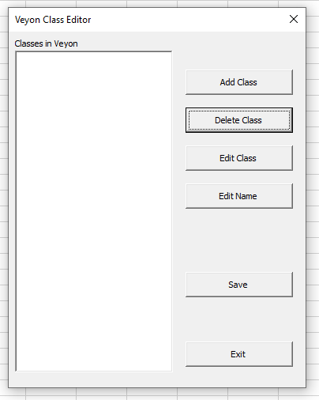
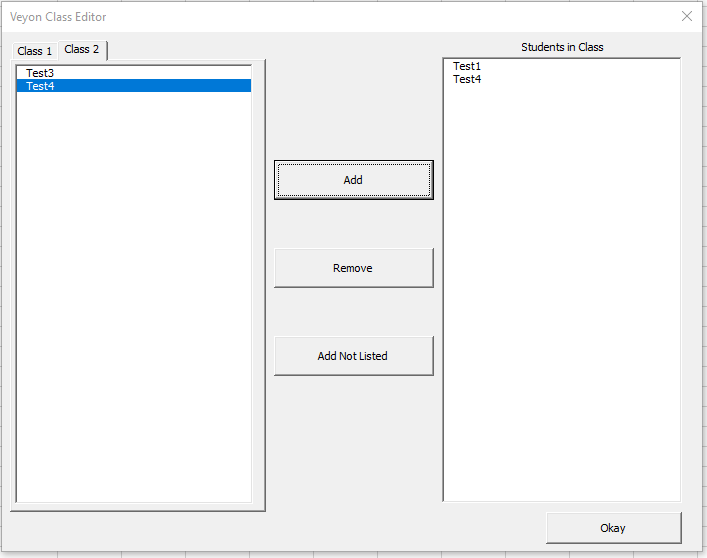
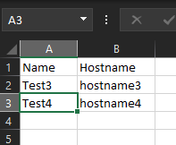
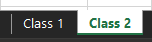

# Veyon Class Builder
Making Veyon asset managment a little easier.

Built to put class asset supervision into the hands of the individual teacher.

## Description
This VBA script facilitates an easier way to configure classes in Veyon. It creates an intuitive user interface to select computers to add to a class.

  

## Installation
REQUIRES EXCEL 2016 OR NEWER

REQUIRES VEYON - It would be pretty much worthless without it. See Veyon on github, to learn about it!

REQUIRES ADMINISTRATOR PRIVILEGES (This is to run the batch file which makes Veyon import the class configuration) 

Copy "Veyon Class Builder.xlsm" and the data directory onto your computer. Both items must be in the same directory but it does not matter where so long as they are together.

You must enable macros for it to run.

Data for editing classes is pulled from the roster.xlsx in the data directory.
It must be formatted as name in column A and hostname in column B. The roster location is by default in the data directory but this location can be changed in the fill_roster file. It can be a network location (this is how I implemented it!)

Each sheet corresponds to a tab in the "Class Editor" menu.

This roster would produce an output like this:

## Support
Please raise issues in the issues tab.
Feel free to contribute!

## Thanks!
Many thanks to the countless forum posts and blogs (I have no idea how many) I consulted in building this! And, of course, thanks to Veyon!

## License
[MIT](https://choosealicense.com/licenses/mit/)
